# Ben
*An cloud native application*

*一款云原生应用*


## 简介

这是一个以排班推送为主要功能的管理saas应用，支持公告推送，排班推送，权限管理等。本应用意在探索云原生应用为软件开发带来的全新开发形式。同时对于微服务，devops等也有实践。


## 预览

### 首页


### 登录

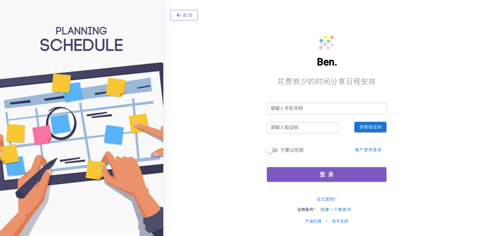


### 个人看板

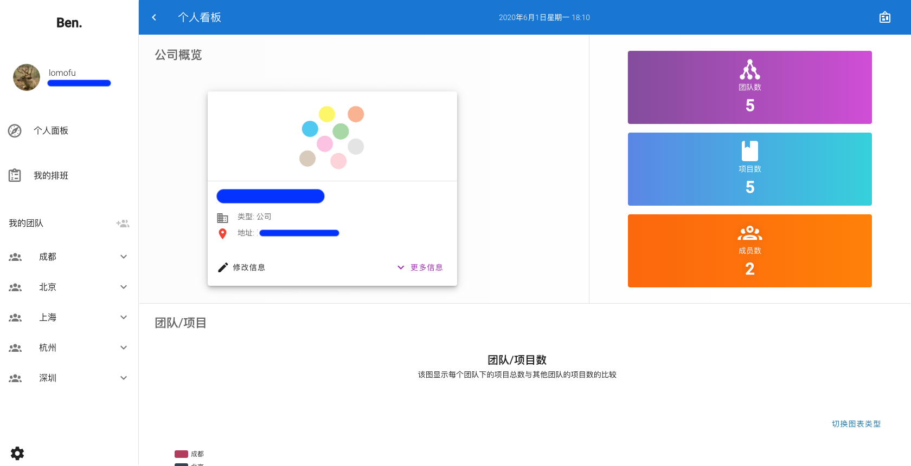


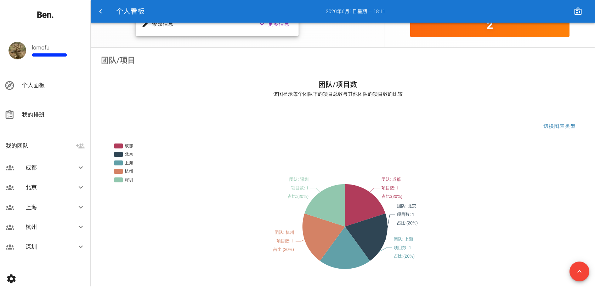


### 我的排班

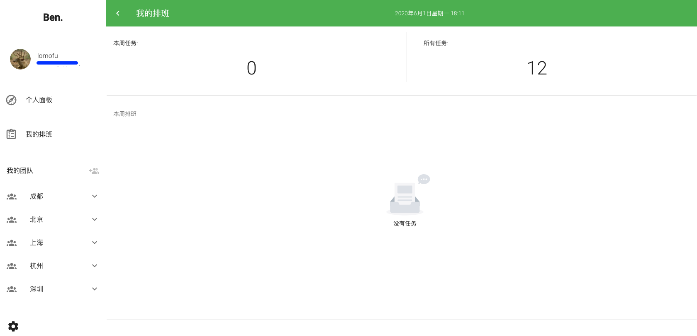


### 团队管理

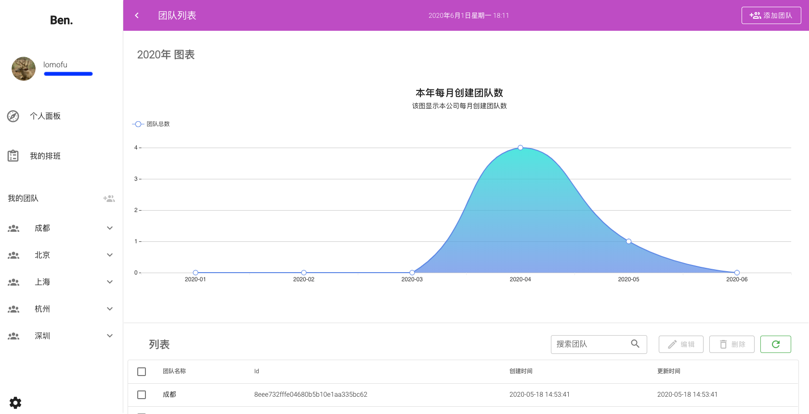


### 项目详情

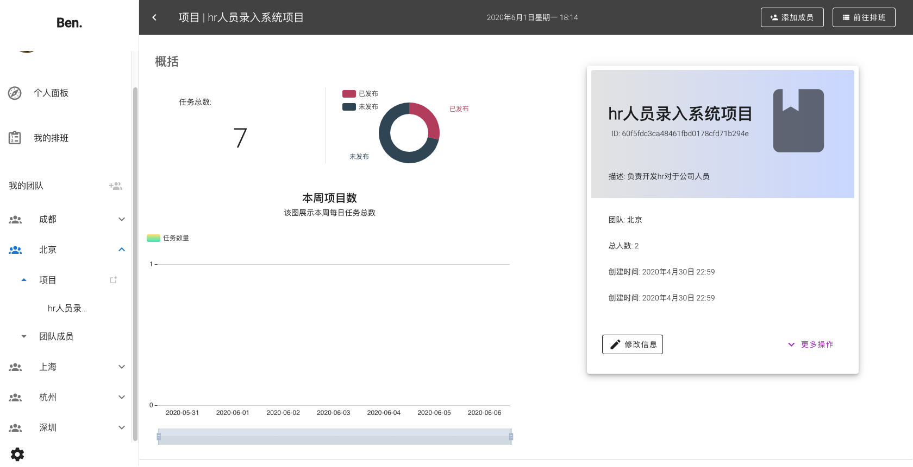


### 排班管理

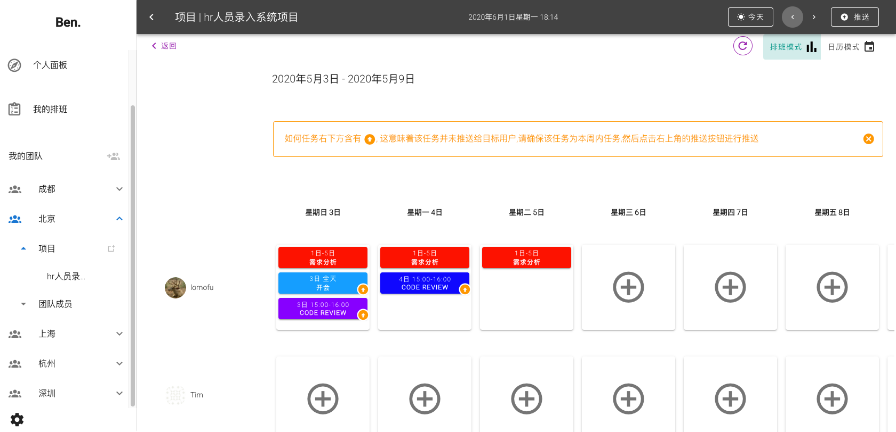


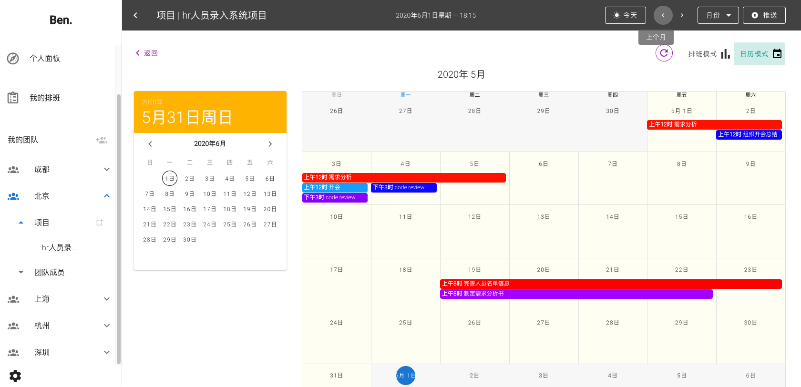


### 设置中心

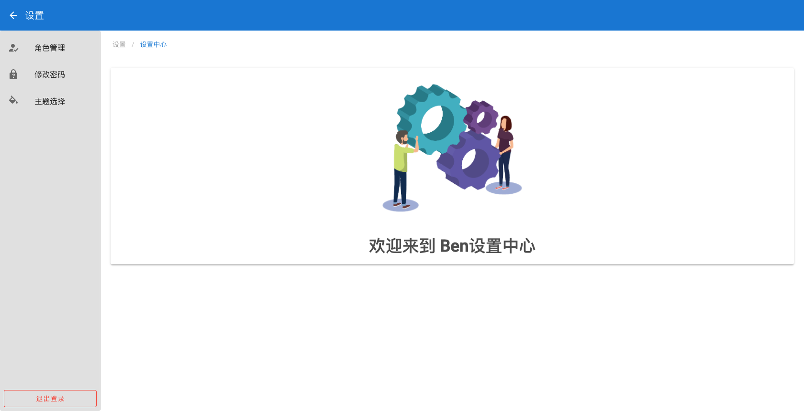


### 暗黑模式

.png)


## 软件架构


### 微服务架构（前后端分离）

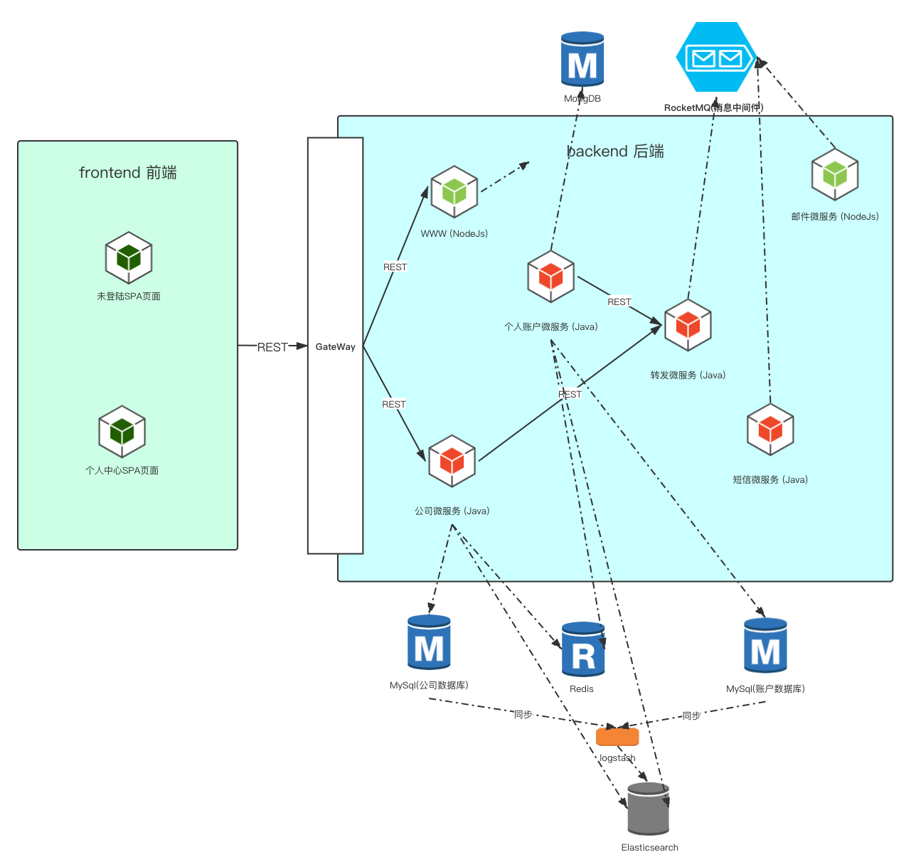

本应用采用的是微服务架构风格，同时开发模式也是前后端分离。前端由vue构建的，后端是由java和nodejs两种语言构建的服务。


### 云原生应用架构 

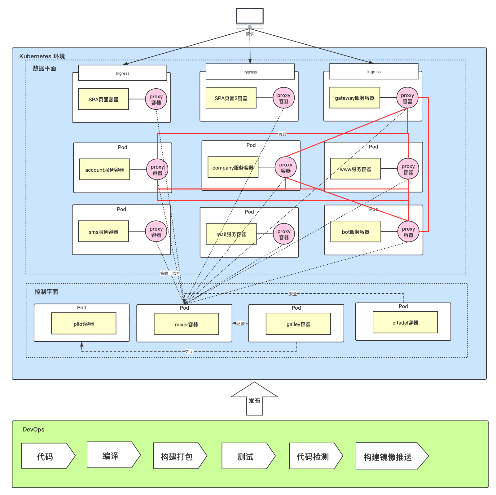


## 技术清单


### 开发框架

- #### Vue.js

- #### Spring Boot

- #### Spring Cloud中组件（Feign，Spring Cloud Gateway）

- #### Koa2


### 应用服务

- #### MySql

- #### MongoDB

- #### Redis

- #### RocketMQ

- #### Seata

- #### ELK


### 运维服务

- #### Docker

- #### Kubernetes

- #### Istio

- #### Rancher

- #### Jenkins

- #### Sonar Qube


## 环境准备

由于本应用是云原生应用，所以支持一键部署到容器云环境，支持kubernetes环境。可以自行搭建kubernetes环境，或者借助云厂商的kubernetes环境。笔者这里以esc云服务器为基础硬件，同时搭建rancher来创建kubernetes环境进行。


### 硬件准备

这里给出我的硬件服务器配置，根据kubernetes以及rancher官方的推荐。单节点最低配置为 2 Core，运存最少4GB。

| 节点  | 配置 | 操作系统 | Docker |
| ------ | ---- | ---- | ---- |
| Master | 2Core 8GB 40GB | Centos 7.6 | 18.6.3 |
| Node1  | 4Core 8GB 40GB | Centos 7.6 | 18.6.3 |
| Node2  | 4Core 8GB 40GB | Centos 7.6 | 18.6.3 |
| Node3  | 2Core 4GB 40GB | Centos 7.6 | 18.6.3 |


### 部署rancher

**1 准备Linux主机**

准备一台已安装64位Ubuntu 16.04或18.04的Linux主机（或其他[Rancher所支持的Linux发行版](https://rancher.com/support-maintenance-terms/all-supported-versions/rancher-v2.3.4/)），要求至少4GB内存。在该主机上安装[Rancher支持的Docker版本](https://rancher.com/support-maintenance-terms/all-supported-versions/rancher-v2.3.4/)。

**2 运行Server**

在主机上执行以下Docker命令，完成Rancher的安装与运行:

```bash
sudo docker run -d --restart=unless-stopped -p 80:80 -p 443:443 -v <主机路径>:/var/lib/rancher/ rancher/rancher:stable
```

之后，打开浏览器，输入https://<安装容器的主机名或IP地址>，您即可以访问Rancher Server的UI了。跟随用户界面给您的引导，即可设置完成您的第一个Rancher集群。


### 创建Kubernetes集群

rancher已经将创建Kubernetes做的非常简单，只需要点击页面上的创建集群，根据选项最后生成的命令在每个节点的主机上运行即可。详情可以参考[官方文档](https://docs.rancher.cn/rancher2x/#_1-what-s-rancher?)


### 其他环境准备

- #### MySql 数据库

- #### Redis数据库

- #### [RocketMQ](https://github.com/lomofu/documents/blob/2020/kubernetes/pratice/Rancher搭建RocketMQ.md)

- #### [ELK](https://github.com/lomofu/documents/blob/2020/kubernetes/pratice/Rancher搭建ELK.md)

- #### Seata


## 配置文件

因为采用docker容器的方式，所以需要提前构建好docker镜像并上传到镜像仓库。


### Account服务

> ##### 该服务由java编写，采用SpringBoot框架。account服务主要负责应用中账户，角色权限相关服务。对应代码为模块 `account-api` 和 `account-svc`。

**数据库**

- **MySql**

  创建ben_account数据库运行数据库脚本，位于`db/account/ben_account.sql`。

- **MongoDB**

  创建ben文档

**分布式事务Seata**

修改`account-svc/src/main/resources/file.conf`。这里修改的是seata中的事务管理器地址。

```conf
service {
  vgroupMapping.ben-tx-group = "default"
  //这里改成你部署的seata事务管理器
  default.grouplist = "seata.seata:8091"
  enableDegrade = false
  disableGlobalTransaction = false
}
```

**分布式锁**

修改`account-svc/src/main/resources/redisson-对应环境-config.yml`。需要注意的是，这里提供了两个环境的配置文件，如果你使用其中一个需要修改对应的环境的配置文件即可。

```yaml
singleServerConfig:
	#你的redis服务地址
  address: "redis://redis:6379"
  #对应的密码
  password: xxxx
```

**Oss存储**

本项目中oss主要用于头像存储功能，采用的是阿里云oss，如果无特殊需求，可以不用开启修改。

**后续**

只需要通过maven构建SpringBoot应用，并通过`account-svc/Dockerfile` 构建docker镜像即可。


### Company服务

> ##### 该服务由java编写，采用SpringBoot框架。company服务主要负责公司，团队，项目，消息相关服务。对应代码为模块 `company-api` 和 `company-svc`。

**数据库**

创建ben_company数据库运行数据库脚本，位于`db/company/ben_company.sql`。

**分布式事务Seata**

修改`company-svc/src/main/resources/file.conf`。这里修改的是seata中的事务管理器地址。

```conf
service {
  vgroupMapping.ben-tx-group = "default"
  //这里改成你部署的seata事务管理器
  default.grouplist = "seata.seata:8091"
  enableDegrade = false
  disableGlobalTransaction = false
}
```

**分布式锁**

修改`company-svc/src/main/resources/redisson-对应环境-config.yml`。需要注意的是，这里提供了两个环境的配置文件，如果你使用其中一个需要修改对应的环境的配置文件即可。

```yaml
singleServerConfig:
	#你的redis服务地址
  address: "redis://redis:6379"
  #对应的密码
  password: xxxx
```

**后续**

只需要通过maven构建SpringBoot应用，并通过`company-svc/Dockerfile` 构建docker镜像即可。


### Bot服务

> ##### 该服务由java编写，采用SpringBoot框架。bot服务主要负责消息推送相关服务，与消息中间件对接。对应代码为模块 `bot-api` 和 `bot-svc`。

**后续**

只需要通过maven构建SpringBoot应用，并通过`bot-svc/Dockerfile` 构建docker镜像即可。


### SMS服务

> ##### 该服务由java编写，采用SpringBoot框架。SMS服务主要负责消息推送中短信发送的实现。对应代码为模块 `sms-api` 和 `sms-svc`。

需要注意的是，由于某些原因，应用在构建的时候采用了两家的短信服务。一家是京东短信，主要负责短信登录验证码的发送，或者登录错误次数过多的发送。另一个负责推送相关的发送。当然修改为统一一家也十分简单，位于`com/ben/sms/service/impl/SmeServiceImpl.java`这个类下，参考即可修改。


### www服务

> 该服务由Node.js编写，采用Koa2框架。www服务主要负责新账户的注册相关服务。对应代码为模块 `www-svc`。

**api调用**

修改`www-svc/config/env/对应环境.js`

```javascript
api: {
  get accountSvcBaseApi() {
    return "http://account-svc:8080/api/accounts";
  },
  get botSvcBaseApi() {
    return "http://bot-svc:8080/api/bot";
  }
}
```

如果api无特殊需求不建议修改，这里罗列出来方便查寻。寻址是通过kubernetes的服务发现。

**MongoDB**

修改`www-svc/config/env/对应环境.js`

```javascript
 mongodb_config: {
   //你的mongodb地址
    connect: "mongodb://mongodb.mongodb:27017/ben"
  }
```

这里修改你的mongodb的连接地址


### Mail服务

